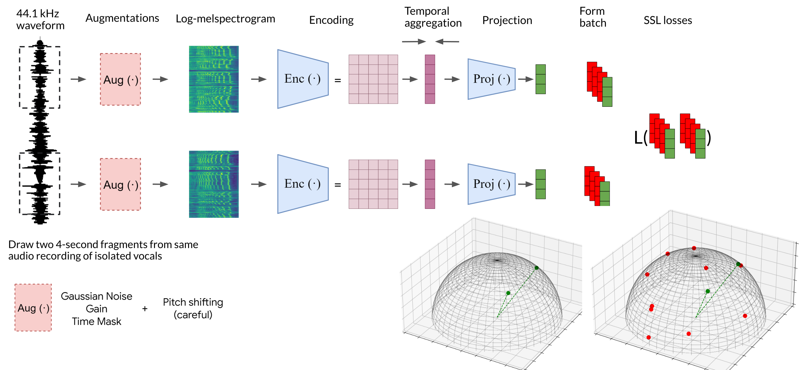
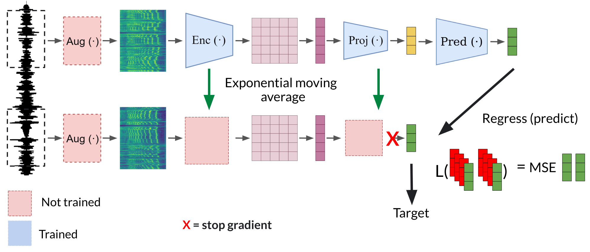

Singer Identity Representation Learning using Self-Supervised Techniques
==============================

This repository contains the code and models of the paper: [Singer Identity Representation Learning using Self-Supervised Techniques](https://hal.science/hal-04186048v1). 

You can find additional visualizations of the singer embeddings and supplementary material [here](https://sites.google.com/view/singer-representation-learning).

*Bernardo Torres, Stefan Lattner and Gaël Richard*


## Pretrained Models <a name="pretrained-models"></a>

You can download and load the pretrained models using the following command:

```python
from singer_identity import load_model
model = load_model(model_name)
model.eval()
```
This will load the model using HuggingFace Hub.
You can also use `load_model(model_name, torchscript=True)` to load a [scripted](https://pytorch.org/tutorials/beginner/Intro_to_TorchScript_tutorial.html) version of the model.

If using a sample rate different than 44.1kHz, you can specify it using `input_sr`, eg. `load_model(model_path, input_sr=16000)` (note that this will upsample the audio to 44.1kHz before computing the embeddings, which is not what the model was trained on).


To manually specify the model (eg for testing trained/finetuned models), make sure to place the model file in a folder with the corresponding `hyperparams.yaml`: 

```python 
model = load_model(model_filename.pt, source=/path/to/model/folder)
```

The pretrained models are available on HuggingFace Hub:

- `byol`: trained with BYOL
- `contrastive`: trained with the decoupled contrastive loss
- `contrastive-vc`: trained with the decoupled contrastive loss + variance and covariance regularizations
- `uniformity`: trained with the uniformity loss
- `vicreg`: trained with the vicreg loss

Example:

```python
from singer_identity import load_model
model = load_model('byol')

audio_batch = ...  # Get audio from somewhere (here in 44.1 kHz), shape: (batch_size, n_samples)
embeddings = model(audio_batch)  # shape: (batch_size, 1000)
```


## Training <a name="training"></a>

We provide the code to train a simple model on the following SSL tasks: 

- Contrastive Learning (SimCLR, COLA) [1,2]
- Uniformity-Alignment [3]
- VICReg [4]


<p align="left">

</p>

And additionally:

- BYOL [5]

<p align="left">

</p>

The default backbone is the EfficientNet-B0 [6], with average pooling as temporal aggregation. 

Our training script uses [PyTorch Lightning](https://www.pytorchlightning.ai/) and [Lightning CLI](https://lightning.ai/docs/pytorch/stable/cli/lightning_cli.html#lightning-cli). To train a model, use the `train.py` script as follows:

```bash
python train.py --config common.yaml --config model_config.yaml
```
See the [config](singer_identity/train_configs/README.md) folder for details on the configuration file for each SSL training.  


### Data Preparation

The default dataloader expects the data to be in the following structure for training. 
```
├── dataset1_name
    │   ├── singer1       <- .wav files of group 1 should be placed here, up to 3 levels of subfolders are allowed
    │   │   ├── file1.wav
    │   │   ├── ..
    │   ├── singer2       
    │   ├── singer3      
    │   └── ...
├── dataset2_name
    │   ├── groupn..
```

The folder labels are not used during training, as we sample audio files independently with random chance. In the config file used to launch training, specify the datasets to use as follows:
    
```yaml
    data:
    class_path: singer_identity.data.siamese_encoders.SiameseEncodersDataModule  # default the dataloader class
    init_args:
        dataset_dirs: 
        - '/Path/to/dataset1/dataset1_name'
        - '/Path/to/dataset2/dataset2_name'
```


 **Data Augmentations:** Data augmentations are applied on the time domain on the fly. To set up augmentations used in the paper check the [config](singer_identity/train_configs/README.md) folder.


**Visualizing Training Logs:** You can visualize the training logs using TensorBoard if you wish. Install TensorBoard and run the following command: `tensorboard --logdir ./logs`.
Replace `class_path` field in the config file to use different a different logger.

### Dependencies

- [PyTorch Lightning](https://www.pytorchlightning.ai/) for training
- [Lightning CLI](https://lightning.ai/docs/pytorch/stable/cli/lightning_cli.html#lightning-cli) for launching training using yaml config files
- [nnAudio](https://github.com/KinWaiCheuk/nnAudio) for computing mel-spectrograms on the fly
- [Audiomentations](https://github.com/iver56/audiomentations) for data augmentation
- [Soundfile](https://pypi.org/project/soundfile/) for audio loading
- [Parselmouth](https://github.com/YannickJadoul/Parselmouth) for pitch shifting

You can use the provided `environment.yml` file to create a conda environment with the required dependencies.

## Evaluation <a name="data-preprocessing"></a>
#### Data Preparation <a name="data-preprocessing"></a>
The following steps prepare the data for evaluation as it was used in the paper. It crops the audio files in non-overlaping segments n seconds and copies them to a flattened structure.

1. Make sure the dataset is in the following structure:

```
├── dataset_root_folder
    ├── dataset_name
    │   ├── singer1       <- .wav files of singer 1 should be placed here, up to 3 levels of subfolders are allowed
    │   │   ├── file1.wav
    │   │   ├── subsubdir
    │   │   │   ├── file2.wav
    │   ├── singer2        
    │   ├── singer3      
    │   └── ... 
```

2. Run the preprocessing script to flatten the wav files under singer subdirectories and crop them in segments of `n_seconds` seconds:

    ```bash
    python preprocess_dataset.py --dataset_root_dir root_folder --dataset_name dataset_folder --segment_length n_seconds --sample_rate sample_rate  
    ```
    This script will extract the wav files from the nested structure and place them in one level per singer. It duplicates the files and crops them in `n_seconds` segments. It will also rename them to the following format: `{subdir}_{subsubdir}_{filename}_0_4_{n_seconds}s.wav`, where 0 and 4 are the start and end of the segment in seconds, `subdir` is the first folder (usually the singer name) and `subsubdir` the second level.

    The preprocessing pipeline will create the following structure:

    ```
    ├── dataset_name
        │   ├── singer1      
        │   │   ├── singer1_file1_0_4_4s.wav
        │   │   ├── singer1_file1_1_4_8_4s.wav   -- if the file is longer than 4 seconds, it will be split in 4s segments
        │   │   ├── singer1_subsubdir_file2_2_0_4_4s.wav
        │   ├── singer2        
        │   │   ├── singer2_file1_0_4_4s.wav
        │   │   ├── ...
        │   ├── singer3      
        │   └── ... 
    ```

4. You can compute speaker pairs for EER using the `preprocess/compute_speaker_pairs.py` script (or use the ones provided in the metadata folder and [here (VocalSet)](metadata/vocalset_renamed_split_4s/speaker_pairs.txt)  [here (M4singer)](metadata/m4singer_renamed_split_4s/speaker_pairs.txt) )

Example:

```bash
python create_speaker_pairs.py -r /path/to/dataset -o /where/sample_pairs/will/be/saved -n n_singers -p n_draws
```

#### Singer similarity evaluation <a name="evaluation"></a>

 First, computing speaker trial pairs is needed (see above). They are stored in a metadata folder, (eg. metadata/vocalset/speaker_pairs.txt, metadata/vctk/speaker_pairs.txt). The EER computation follows the one available on [SUPERB](https://github.com/s3prl/s3prl/tree/main/s3prl). 

```bash
python eval.py -s seed -r root -d data -m model -meta metadata -f use_features -cr compute_rank -ce compute_eer -bs batch_size
```

The arguments are:

- `-s`: random seed for reproducibility
- `-r`: path to the dataset root folder
- `-d`: list of dataset folders to test on
- `-meta`: path to the metadata folder 
- `-m`: path to the model file or huggingface model name
- `-f`: whether to compute scores using the encoder feature embeddings
- `-cr`: whether to compute Mean Normalized Rank (MNR)
- `-ce`: whether to compute EER
- `-bs`: batch size for evaluation

Also available:
- `-du`: whether to use downsample the signals to 16kHz and upsample them back to 44.1kHz before computing the embeddings
- `-p`: whether to compute scores using the projection layer

Example:

```python
python eval.py -s 123 -r /data/datasets -d vocalset -m byol_model -meta test_scores/metadata -f True -cr True -ce True -bs 128
```

**If you want to evaluate your own models** simply override the `load_id_extractor(model_file, source)` method `eval.py`.

#### Singer identification evaluation <a name="evaluation"></a>

- To train singer identification linear classifiers:

*Coming soon*


## Datasets <a name="datasets"></a>

The model was tested with the following out of domain datasets:

1. [VCTK](https://datashare.ed.ac.uk/handle/10283/2950)
2. [NUS-48E](http://www.smcnus.org/wp-content/uploads/2013/09/05-Pub-NUS-48E.pdf)
3. [M4Singer](https://github.com/M4Singer/M4Singer)
4. [Vocalset](https://zenodo.org/record/1193957)


## Citation <a name="citation"></a>

If you find this work useful for your research, please cite the paper:

```
@inproceedings{torres2023singer,
  title={Singer Identity Representation Learning using Self-Supervised Techniques},
  author={Torres, Bernardo and Lattner, Stefan and Richard, Gael},
  booktitle={International Society for Music Information Retrieval Conference (ISMIR 2023)},
  year={2023}
}
```
## References <a name="references"></a>


[1] T. Chen, S. Kornblith, M. Norouzi, and G. Hinton, “A simple framework for contrastive learning of visual representations,” in ICML, 2020.

[2] A. Saeed, D. Grangier, and N. Zeghidour, “Contrastive learning of general-purpose audio representations,” in ICASSP, 2021.

[3] T. Wang and P. Isola, “Understanding contrastive representation learning through alignment and uniformity on the hypersphere,” in ICML, 2020.

[4] A. Bardes, J. Ponce, and Y. LeCun, “VICReg: Variance-invariance-covariance regularization for self-supervised learning,” in ICLR, 2022.

[5] J.-B. Grill et al., “Bootstrap your own latent - A new approach to self-supervised learning,” in NeurIPS, 2020.

[6] M. Tan and Q. Le, “Efficientnet: Rethinking model scaling for convolutional neural networks,” in ICML, 2019.


